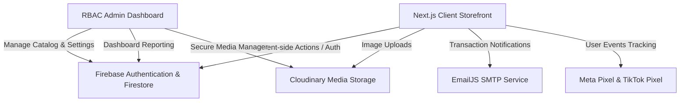

# 🛍️ NK Fashion Store — Premium E-Commerce Platform

[](https://nextjs.org/)
[](https://www.typescriptlang.org/)
[](https://tailwindcss.com/)
[](https://firebase.google.com/)
[](https://cloudinary.com/)

A modern, highly-optimized, full-stack e-commerce solution tailored for **NK Fashion Store**, a premium fashion boutique based in Tangalle, Sri Lanka. This platform features a complete client storefront with island-wide Cash on Delivery (COD) shipping and a secure, feature-rich **Role-Based Access Control (RBAC)** Admin Dashboard for inventory, order fulfillment, promotions, and analytics tracking.

---

## 🌐 Live Infrastructure

*   **Production Storefront:** [https://nk-fashion-store--e-commerce-platform.vercel.app/](https://nk-fashion-store--e-commerce-platform.vercel.app/) *(or active deployment URL)*
*   **Admin Panel:** Secure access at `/admin`
*   **Target Region:** Sri Lanka (Island-wide shipping via COD)

---

## ✨ System Architecture



---

## 🔥 Key Features

### 🛒 Customer Storefront
*   **✨ Immersive UI/UX** — Framer Motion-powered animations, including interactive heroes, shuffling visual trays, and staggered entrances.
*   **🔍 Smart Product Discovery** — Fast client-side searching, categorization, stock filtering, and price range controls.
*   **👕 Variant-Specific Details** — Interactive color/size selectors, instant low-stock notifications, and sizing guides.
*   **💼 Auth-Gated Workflows** — Secure shopping carts, user accounts, and personal order histories.
*   **🚚 Simplified Checkout** — Single-step COD checkout with address autocompletion cached in the user's profile database.
*   **📦 Track Your Order** — Real-time order progress lookup utilizing either a unique order reference number or a phone number.

### 🛡️ Secure Admin Panel (`/admin`)
*   **👥 Role-Based Access Control (RBAC)** — Distinct workspaces and menus dynamically tailored for *Super Admins*, *Inventory Managers*, *Order Managers*, *Content Managers*, and *Customer Support*.
*   **📊 Business Analytics** — Executive reports highlighting gross revenue, order volume, best-selling styles, and category performance.
*   **🛍️ Catalog & Variants Manager** — Full CRUD control over products with multiple color/size variant stock increments and direct Cloudinary image uploads.
*   **🎯 Promotions Editor** — Real-time controls for banner promotions, landing page CTA copy, and featured product displays.
*   **⚙️ System Configurations** — Direct adjustments for delivery rates, regional options, contact coordinates, and social handles.

### ⚙️ Integrations & Technical Stack
*   **Firebase Integration:** Customer and administrator environments run through unified Firestore tables utilizing custom client-side Auth Providers.
*   **Social Marketing Pixels:** Automatic client event triggers (`ViewContent`, `AddToCart`, `Purchase`) reporting to Meta and TikTok tracking endpoints.
*   **SMTP Deliverability:** Transactional emails dispatching instantly through EmailJS templates.
*   **SEO Optimization:** Dynamic sitemap configurations and strict crawlers constraints (`robots.txt`) ensuring only marketing channels are indexable.

---

## 🛠️ Technology Stack

| Layer | Component | Notes |
|:---|:---|:---|
| **Frontend Framework** | Next.js 15+ (App Router) | High-performance Server Components & SEO |
| **Logic & Types** | TypeScript 5+ | Robust types & compiler safety |
| **Styling Engine** | Tailwind CSS v4.0 | Utility-first styling with modern variables |
| **Motion Physics** | Framer Motion | Smooth state transitions and micro-interactions |
| **Database** | Firebase Firestore | Low-latency document store |
| **Authentication** | Firebase Auth | Secure customer and administrative flows |
| **Asset Manager** | Cloudinary API | Real-time compression and image hosting |
| **Communications** | EmailJS (Gmail service) | Verified transactional email channels |
| **Social Pixels** | Meta & TikTok SDKs | Marketing conversion trackings |

---

## 📂 Project Structure

```
├── app/                          # Next.js App Router Structure
│   ├── page.tsx                  # Home Landing Page
│   ├── shop/                     # Dynamic Shop & Catalog
│   ├── product/[id]/             # Detailed Product Specifications
│   ├── cart/                     # Shopping Cart Context Panel (Auth-gated)
│   ├── checkout/                 # Secure Shipping Details Form (Auth-gated)
│   ├── order-confirmation/       # Direct Purchase Landing Page
│   ├── track-order/              # Public Order Tracker Console
│   ├── account/                  # Customer Registration & Profile Directory
│   └── admin/                    # Core RBAC Dashboard
│       ├── dashboard/            # Executive Overview & Charts
│       ├── products/             # Product Variant & Catalog Management
│       ├── orders/               # Shipping Status Adjustments
│       ├── users/                # Administrative Team Roles
│       └── settings/             # System Configuration Properties
├── components/                   # Reusable UI Components
│   ├── home/                     # AnimatedHero, HeroImageShuffle, BrandPhilosophy
│   ├── admin/                    # AdminShell, ProductForm, ProtectedRoute
│   └── Navbar.tsx & Footer.tsx   # Global Header & Footers
├── context/                      # Global Context State Providers
│   ├── CartContext.tsx           # Cart Persistence
│   ├── CustomerAuthContext.tsx   # Client Auth State
│   └── AdminAuthContext.tsx      # Admin Role Credentials
├── lib/                          # Helpers & Integration Scripts
│   ├── firebase.ts               # Core Config Initialization
│   ├── types.ts                  # TypeScript Shared Interfaces
│   ├── productService.ts         # Catalog Operations
│   ├── orderService.ts           # Sales Records Operations
│   └── pixels.ts                 # Analytical Tracking Emitters
```

---

## 🚀 Installation & Local Development

Follow these steps to run a local instance of the application:

### 1. Repository Setup
```bash
git clone https://github.com/chamika217/nk-fashion-store--E-commerce-Platform.git
cd nk-fashion-store--E-commerce-Platform
```

### 2. Dependency Resolution
```bash
npm install
```

### 3. Configure Local Environments
Create a file named `.env.local` inside the project root:
```env
# Firebase API Credentials
NEXT_PUBLIC_FIREBASE_API_KEY=your_api_key
NEXT_PUBLIC_FIREBASE_AUTH_DOMAIN=your_auth_domain
NEXT_PUBLIC_FIREBASE_PROJECT_ID=your_project_id
NEXT_PUBLIC_FIREBASE_STORAGE_BUCKET=your_storage_bucket
NEXT_PUBLIC_FIREBASE_MESSAGING_SENDER_ID=your_sender_id
NEXT_PUBLIC_FIREBASE_APP_ID=your_app_id

# Cloudinary Integration
NEXT_PUBLIC_CLOUDINARY_CLOUD_NAME=your_cloudinary_name
NEXT_PUBLIC_CLOUDINARY_UPLOAD_PRESET=your_unsigned_preset_name

# EmailJS Service Credentials
NEXT_PUBLIC_EMAILJS_SERVICE_ID=your_emailjs_service
NEXT_PUBLIC_EMAILJS_TEMPLATE_ID=your_emailjs_template
NEXT_PUBLIC_EMAILJS_PUBLIC_KEY=your_public_key

# Analytics (Optional)
NEXT_PUBLIC_META_PIXEL_ID=your_meta_pixel
NEXT_PUBLIC_TIKTOK_PIXEL_ID=your_tiktok_pixel
```

### 4. Database Setup & Firestore Rules
1. Set up a **Firebase Console** project, enable **Firestore Database**, and configure **Authentication** (Email/Password).
2. Copy and apply the security rules from `firestore.rules` into your Firebase Console Rules panel.
3. Seed the admin configurations by going to `/admin/users` inside the dashboard and selecting **"Seed Default Roles"**.
4. To grant access to your administrator account, create an `admins/{uid}` document manually in your Firestore, and assign `roleId` referencing one of the seeded administrator templates.

### 5. Running the Application
```bash
npm run dev
```
Open [http://localhost:3000](http://localhost:3000) to view the development server.

---

## 🏪 Boutique Business Details

*   **Location:** Tangalle, Sri Lanka
*   **Fulfillment:** Island-Wide Cash on Delivery (COD) shipping
*   **Official Social Channels:** [Facebook](https://www.facebook.com/share/1cNJSsvhvH/) · [TikTok](https://www.tiktok.com/@nimzkp)

---

## 📄 Licensing

Private Commercial Software. All intellectual property, assets, and styling components remain under copyright protection © 2026 **NK Fashion Store**.
